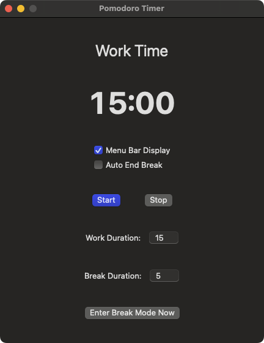

# PomodoroLock

Eine einfache und effektive Pomodoro-Timer-Anwendung für macOS, die Ihnen hilft, konzentriert und produktiv zu bleiben.

🚀 Ihr exklusiver Pomodoro-Timer mit intelligentem Bildschirmsperre, um Ihnen zu helfen, sich tief zu konzentrieren! 🚀

🔹 Wissenschaftliches Zeitmanagement - Pomodoro-Technik, um Ihre Effizienz zu verdoppeln!
🔹 Automatischer Bildschirmsperrmodus - Erzwingen Sie Pausen, um Ermüdung zu vermeiden und Ihre Gesundheit zu schützen!
🔹 Anpassbare Dauer - Stellen Sie die Arbeits- und Pausenzeiten flexibel ein, um Ihrem Rhythmus zu entsprechen!
🔹 Minimalistisches UI-Design - Sauber, intuitiv und ablenkungsfrei, um sich auf Ihre Aufgaben zu konzentrieren!
🔹 Effizienter Arbeitsablauf - Betreten Sie leicht den Fokusmodus, verabschieden Sie sich von Prokrastination und steigern Sie Ihre Produktivität!

✨ Machen Sie die Arbeit rhythmischer und die Konzentration einfacher! ✨
🔥 Laden Sie jetzt herunter und erleben Sie Ihr effizientes Konzentrationswerkzeug! 🔥

## Funktionen

- **Umsetzung der Pomodoro-Technik**: Wechseln Sie zwischen konzentrierten Arbeitseinheiten und Pausen
- **Anpassbare Timer**: Stellen Sie Ihre bevorzugten Arbeits- und Pausenzeiten ein
- **Menüleisten-Integration**: Schneller Zugriff auf Timer-Steuerungen aus der Menüleiste
- **Pausenbildschirm**: Vollbild-Pausenbenachrichtigung, die Ihnen hilft, tatsächlich Pausen zu machen
- **Mehrsprachige Unterstützung**: Verfügbar in Englisch, Chinesisch, Japanisch, Koreanisch, Französisch, Deutsch und Spanisch

## Installation

1. Laden Sie die neueste Version von der [Releases](https://github.com/yourusername/PomodoroLock/releases)-Seite herunter
2. Ziehen Sie die PomodoroLock-App in Ihren Anwendungsordner
3. Starten Sie die App

## Verwendung

### Grundlegende Steuerung

- **Start/Pause**: Starten oder pausieren Sie den aktuellen Timer
- **Stopp**: Setzen Sie den Timer auf seinen Ausgangszustand zurück
- **In den Pausenmodus wechseln**: Starten Sie manuell eine Pausensitzung

### Einstellungen

- **Menüleiste anzeigen**: Schalten Sie die Sichtbarkeit des Menüleistensymbols ein oder aus
- **Pause automatisch beenden**: Wählen Sie, ob Pausenbildschirme automatisch geschlossen werden, wenn die Zeit abgelaufen ist

### Menüleisten-Steuerung

Das Menüleistensymbol bietet schnellen Zugriff auf:
- Öffnen des Hauptfensters
- Starten/Pausieren des Timers
- Stoppen des Timers
- Beenden der Anwendung

## Funktionsweise

PomodoroLock folgt der Pomodoro-Technik:

1. **Arbeitseinheit**: Konzentrieren Sie sich für die eingestellte Arbeitsdauer auf Ihre Aufgabe (Standard: 15 Minuten)
2. **Pausenbenachrichtigung**: Wenn die Arbeitszeit endet, erscheint eine Vollbild-Pausenbenachrichtigung
3. **Pausenzeit**: Machen Sie eine kurze Pause (Standard: 5 Minuten)
4. **Wiederholen**: Setzen Sie den Zyklus fort, um die Produktivität aufrechtzuerhalten

## Systemanforderungen

- macOS 11.0 (Big Sur) oder höher
- 10 MB verfügbarer Festplattenspeicher

## Datenschutz

PomodoroLock sammelt keine Benutzerdaten und benötigt keinen Internetzugang.

## Lizenz

Dieses Projekt ist unter der MIT-Lizenz lizenziert - siehe die LICENSE-Datei für Details.

## Danksagungen

- Inspiriert von der von Francesco Cirillo entwickelten Pomodoro-Technik
- Erstellt mit SwiftUI für macOS