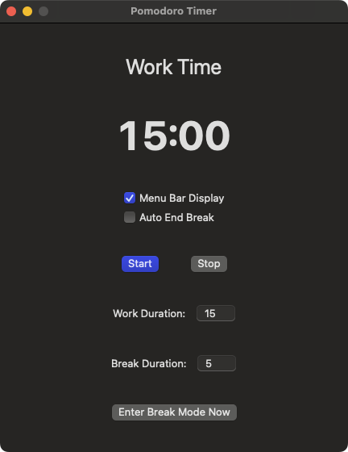

# PomodoroLock

<!--  -->

一个简单高效的macOS番茄钟应用，帮助您保持专注和提高生产力。

🚀 你的专属番茄钟，智能锁屏助你深度专注！ 🚀

🔹 科学时间管理 —— 番茄工作法，让你的效率翻倍！
🔹 自动锁屏模式 —— 强制休息，避免过度疲劳，保护健康！
🔹 可自定义时长 —— 灵活设定工作与休息时间，适配你的节奏！
🔹 极简 UI 设计 —— 干净、直观、无干扰，专注你的任务！
🔹 高效工作流 —— 轻松进入专注模式，告别拖延，提高生产力！

✨ 让工作更有节奏，让专注变得轻松！ ✨
🔥 现在下载，立即体验你的 高效专注神器！ 🔥

## 功能特点

- **番茄工作法实现**：在专注工作时段和休息时间之间交替
- **可自定义计时器**：设置您喜欢的工作和休息时长
- **菜单栏集成**：从菜单栏快速访问计时器控制
- **休息屏幕**：全屏休息通知，帮助您真正休息
- **多语言支持**：支持英语、中文、日语、韩语、法语、德语和西班牙语

## 安装方法

1. 从[发布页面](https://github.com/yourusername/PomodoroLock/releases)下载最新版本
2. 将PomodoroLock应用拖到应用程序文件夹
3. 启动应用

## 使用方法

### 基本控制

- **开始/暂停**：开始或暂停当前计时器
- **停止**：将计时器重置为初始状态
- **进入休息模式**：手动开始休息时段

### 设置

- **菜单栏显示**：切换菜单栏图标的可见性
- **自动结束休息**：选择休息时间结束时是否自动关闭休息屏幕

### 菜单栏控制

菜单栏图标提供快速访问：
- 打开主窗口
- 开始/暂停计时器
- 停止计时器
- 退出应用

## 工作原理

PomodoroLock遵循番茄工作法：

1. **工作时段**：在设定的工作时长内专注于任务（默认：15分钟）
2. **休息通知**：工作时间结束时，会出现全屏休息通知
3. **休息时间**：短暂休息（默认：5分钟）
4. **重复**：继续循环以保持生产力

## 系统要求

- macOS 11.0 (Big Sur) 或更高版本
- 10MB可用磁盘空间

## 隐私

PomodoroLock不收集任何用户数据，也不需要互联网连接。

## 许可证

本项目采用MIT许可证 - 详情请参阅LICENSE文件。

## 致谢

- 灵感来自Francesco Cirillo开发的番茄工作法
- 使用SwiftUI为macOS构建